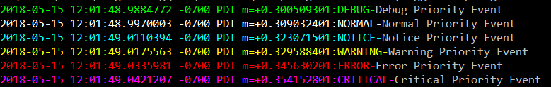

[](https://travis-ci.com/DistributedClocks/GoVector)
[](https://godoc.org/github.com/DistributedClocks/GoVector)
[](https://goreportcard.com/report/github.com/DistributedClocks/GoVector)
[](https://opensource.org/licenses/MIT)
[](https://codecov.io/gh/DistributedClocks/GoVector)


GoVector is a vector clock logging library written in Go. The [vector
clock algorithm](https://en.wikipedia.org/wiki/Vector_clock) is used
to order events in distributed systems in the absence of a centralized
clock. GoVector implements the vector clock algorithm and provides
feature-rich logging and encoding infrastructure. 

Vector clock events
are generated using 3 key functions, `PrepareSend`, `UnpackReceive`,
and `LogLocalEvent`. PrepareSend encodes messages for network
transport, updates GoVectors local time, and logs a sending event.
UpackReceive decodes messages from the network, merges GoVectors local
clock with the received clock, and logs a receiving event. LogLocalEvent
event ticks the clock, and logs a message.

This library can be added to a Go project to generate a
[ShiViz](http://bestchai.bitbucket.io/shiviz/)-compatible vector-clock
timestamped log of events in a concurrent or distributed system.
This library can also be used to generate [TSViz](https://bestchai.bitbucket.io/tsviz/)-compatible
log of events.
GoVector is compatible with Go 1.4+. 

* govec/    	: Contains the Library and all its dependencies
* govec/vclock	: Pure vector clock library
* govec/vrpc	: Go's rpc with GoVector integration
* example/  	: Contains some examples instrumented with different features of GoVector

### Installation

To install GoVector you must have a correctly configured go development
environment. See [How to Write Go
Code](https://golang.org/doc/code.html).

Once you set up your environment, GoVector can be installed with the go
tool command:

> go get -u github.com/DistributedClocks/GoVector

###   Usage

The following is a basic example of how this library can be used:

```go
	package main

	import "github.com/DistributedClocks/GoVector/govec"

	func main() {
		//Initialize GoVector logger
		Logger := govec.InitGoVector("MyProcess", "LogFile")
		
		//Encode message, and update vector clock
		messagepayload := []byte("samplepayload")
		vectorclockmessage := Logger.PrepareSend("Sending Message", messagepayload, govec.GetDefaultLogOptions())
		
		//send message
		connection.Write(vectorclockmessage)

		//In Receiving Process
		connection.Read(vectorclockmessage)
		//Decode message, and update local vector clock with received clock
		Logger.UnpackReceive("Receiving Message", vectorclockmessage, &messagepayload, govec.GetDefaultLogOptions())

		//Log a local event
		Logger.LogLocalEvent("Example Complete", govec.GetDefaultLogOptions())
	}
```
For complete documentation with examples see GoVector's [GoDoc](https://godoc.org/github.com/DistributedClocks/GoVector/govec).

### End-to-End Examples

* Client-Server GoVector instrumentation [Examples/ClientServer.go](example/ClientServer/ClientServer.go)
* RPC Client-Server program [Examples/RpcClientServer.go](example/RpcClientServer/RpcClientServer.go)

### Generating ShiViz/TSViz comaptible logs

By default, when you download the GoVector package using the go get command, the command installs a binary of the to-level file govec.go by the name of GoVector in the directory "**$GOPATH/bin**". As long as this directory is part of your path, you can run the GoVector binary to generate a ShiViz or TSViz compatible log from all the logs in a given directory.

**Note** : Make sure that you are running the GoVector binary on a directory that contains log files from the same execution of the system. If it contains logs from multiple executions, then ShiViz and TSViz won't be able to interpret the log file.

#### Usage

To generate a ShiViz-compatible log file called "hello.log" from all log files in the diretory "a/b/c" do the following,

```
    > GoVector --log_type shiviz --log_dir a/b/c --outfile hello.log
```

Similarly, to generate a TSViz-compatible log file called "hello-ts.log" from all log files in the directory "d/e/f" do the following,

```
    > GoVector --log_type tsviz --log_dir d/e/f --outfile hello-ts.log
```

### Motivation

GoVector was initially developed as a pedagogical tool for UBC's computer science course on distributed systems (CPSC 416). Students new to the development of distributed systems can feed generated logs into [ShiViz](http://bestchai.bitbucket.io/shiviz/) to visualize their program executions and reason about event orderings. Furthermore, GoVector's marshaling functionality reduces the effort needed to write networking code that is largely boilerplate.

Eventually, as a result of student requests, GoVector has been transformed into a general-purpose logging tool. Additional features include optimized IO, priority logging, [TSViz](https://bestchai.bitbucket.io/tsviz/) compatibility, and RPC instrumentation.

### Dependencies

GoVector has the following dependencies: 

+ [msgpack](https://github.com/vmihailenco/msgpack)
+ [go-colortext](https://github.com/daviddengcn/go-colortext)

### Contributors

+ Ivan Beschastnikh
+ Mike Fink
+ Stewart Grant
+ Clement Fung
+ Fabian Ruffy
+ Vaastav Anand

### Output Example

The source code from the useage example produces the following log into a file named "LogFile.txt":

	MyProcess {"MyProcess":1}
	Initialization Complete
	MyProcess {"MyProcess":2}
	Sending Message
	MyProcess {"MyProcess":3}
	Receiving Message
	MyProcess {"MyProcess":4}
	Example Complete


Here is a sample output of the priority logger:


Here is an example of ShiViz output generated by an RPC client server
interaction:


<!-- July 2017: Brokers are no longer supported, maybe they will come back.

### VectorBroker

type VectorBroker
   * func Init(logfilename string, pubport string, subport string)

### Usage

    A simple stand-alone program can be found in server/broker/runbroker.go 
    which will setup a broker with command line parameters.
   	Usage is: 
    "go run ./runbroker (-logpath logpath) -pubport pubport -subport subport"

    Tests can be run via GoVector/test/broker_test.go and "go test" with the 
    Go-Check package (https://labix.org/gocheck). To get this package use 
    "go get gopkg.in/check.v1".
    
Detailed Setup:

Step 1:

    Create a Global Variable of type brokervec.VectorBroker and Initialize 
    it like this =

    broker.Init(logpath, pubport, subport)
    
    Where:
    - the logpath is the path and name of the log file you want created, or 
    "" if no log file is wanted. E.g. "C:/temp/test" will result in the file 
    "C:/temp/test-log.txt" being created.
    - the pubport is the port you want to be open for publishers to send
    messages to the broker.
    - the subport is the port you want to be open for subscribers to receive 
    messages from the broker.

Step 2:

    Setup your GoVec so that the real-time boolean is set to true and the correct
    brokeraddr and brokerpubport values are set in the Initialize method you
    intend to use.

Step 3 (optional):

    Setup a Subscriber to connect to the broker via a WebSocket over the correct
    subport. For example, setup a web browser running JavaScript to connect and
    display messages as they are received. Make RPC calls by sending a JSON 
    object of the form:
            var msg = {
            method: "SubManager.AddFilter", 
            params: [{"Nonce":nonce, "Regex":regex}], 
            id: 0
            }
            var text = JSON.stringify(msg)

####   RPC Calls

    Publisher RPC calls are made automatically from the GoVec library if the 
    broker is enabled.
    
    Subscriber RPC calls:
    * AddNetworkFilter(nonce string, reply *string)
        Filters messages so that only network messages are sent to the 
        subscriber.      
    * RemoveNetworkFilter(nonce string, reply *string)
        Filters messages so that both network and local messages are sent to the 
        subscriber.
    * SendOldMessages(nonce string, reply *string)
        Sends any messages received before the requesting subscriber subscribed.
  -->
